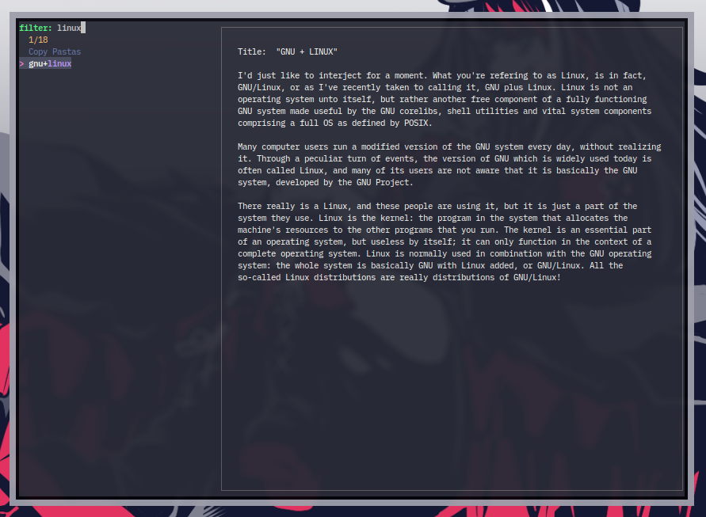

# fzf copypasta

Copy Pasta picker for fzf



## Install

```
git clone https://github.com/eylles/fzf-copypasta
cd fzf-copypasta
make install
```

i also include a example copypasta for the format and an example config file, the config file IS
NOT VERIFIED FOR INCORRECT OPTIONS, if you set any of te variables to something that doesn't make
sense the script will not run as expected.

the config file is expected to be located in `${XDG_CONFIG_HOME:-${HOME}/.config}/copypastas/configrc`

the script attempts to launch any of the avaible terminals with either the name or class
`CopyPaster` so that you can match it on your window manager config and give rules like ontop,
floating, centered and more.


this script is based on [term-dmenu](https://github.com/Seirdy/term-dmenu)


Requirements:

|program|function|
|----|----|
|xclip|copy to clipboard (x11)|
|wl-clipboard|copy to clipboard (wayland)|
|posix shell interpreter|main program|
|coreutils|main program functions (rm, cp, cat)|
|fzf|selection menu|
|terminal emulator|where the program will run|
